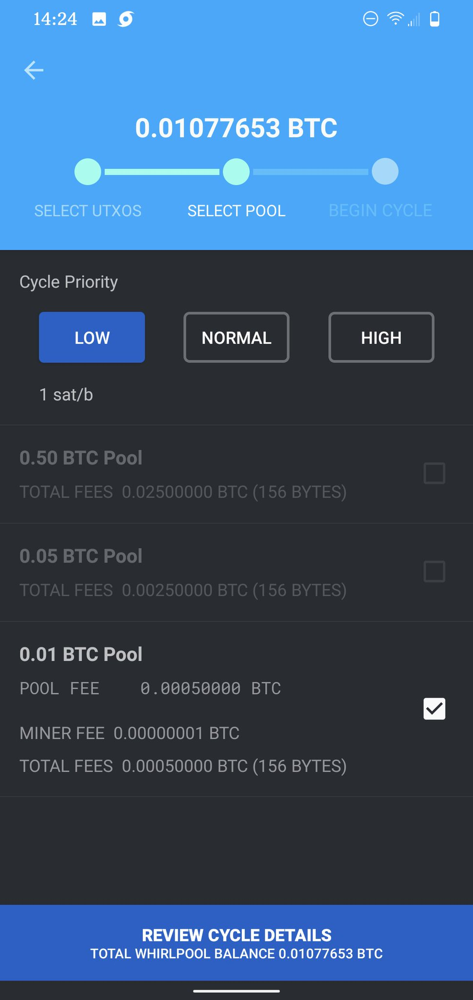

# Initiating Whirlpool

After making your initial deposit into your @SamouraiWallet you can select the Whirlpool icon, Mix UTXOs, & select which UTXOs to mix.

Then you can select the fee rate & liquidity pool. The liquidity pool size is what determines the amount in the UTXOs you'll be getting back. i.e, 0.01 pool give you UTXOs with 0.01 BTC available each. There are three pools to choose from: 0.5, 0.05, & 0.01. 

You can mix any amount of BTC you want in any of the pools, regardless of the number of UTXOs you'll be mixing, you only pay the one time mixing fee. Once you start mixing, you can continue mixing for free.

