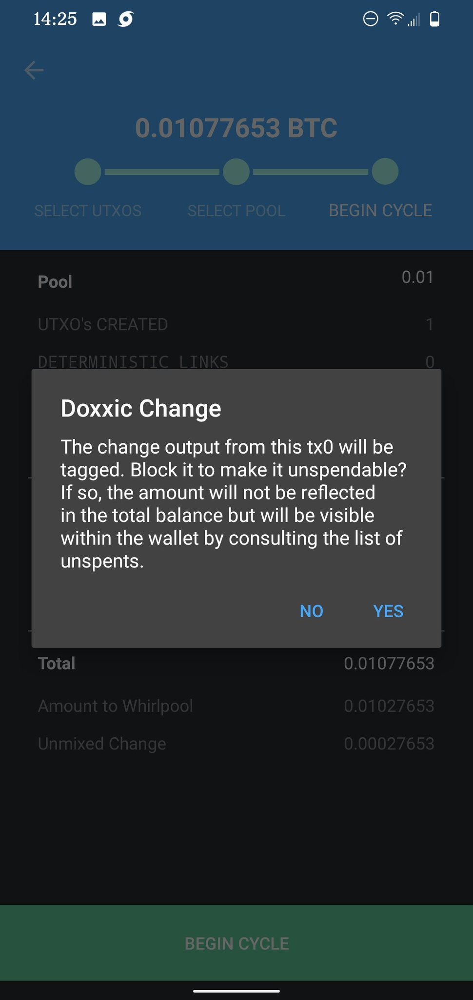

# Doxxic Change
You'll get a warning about Toxic Change, this is important. Your outputs will all be an even 0.01 BTC. If you Whirlpooled 0.029 BTC you have to choose what to do with the 0.009 in change. Make it un-spendable to protect your privacy or if you make it spendable, it is more likely that you will doxx yourself.

The separation of your doxxic change from your pre-mix UTXOs is called Transaction 0 (Tx0). This is a critical step in a ZeroLink CoinJoin implementation because having the unmixed change as part of the CoinJoin transaction will cause deterministic links to remain in tact. The point of the ZeroLink CoinJoin is to break those deterministic links. Seperating it from the pre-mix UTXOs prior to mixing breaks deterministic links. 

