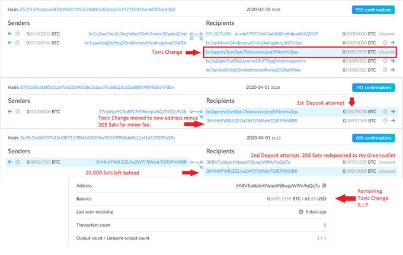
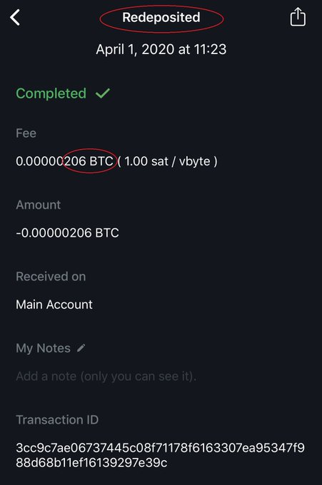

# Results
Whirlpooling is important because let's say an adversary knew I owned input #1 (0.00140586) Then they know I sent my output to address ending in 22ep. But from there, when we Whirlpool they have 3 options to follow the bitcoin.

Here is what happens when you Whirlpool & make your change un-spendable:

1) Deposit to address ending in 22ep

2) Deposit to address ending in 22ep

3) Fee

4) Toxic Change

5) 0.01 liquidity output #1

6) 0.01 liquidity output #2

It's reasonable for our adversary to follow the highest outputs. i.e., the address ending with vrrx was in a tx with 5 inputs & 5 equal outputs. Some of those outputs were used as inputs to tx's with several 0.01 BTC inputs. In legal terms this is called reasonable doubt.

As for the toxic change, it was 0.00921765 BTC and I marked it un-spendable. I tried sending a little more BTC to the same doxxic change address and even so it still remains un-spendable. That's good because I am ensured that I will not accidentally include these funds in a future spend. If I want to spend the doxxic change later, I can adjust it's spend-ability status in the app. 

