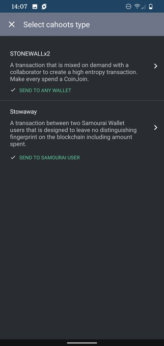

# Post Mix
After the post-mix outputs are ready to spend, you have the option to turn on Cahoots. Then you can select Stonewallx2 or Stowaway. But you either need premium or another Samourai user to utilize these cool features. Spending all of your mixed outputs reduces privacy.

Overall @SamouraiWallet mobile app is an easy way to mix on the go with a user friendly interface. I wish I had read all the instructions first so that I better understood the liquidity pools & toxic change. 

To learn more check out this podcast: [Stephan Livera #150](https://stephanlivera.com/episode/150/)

Thanks for reading! I hope this got you thinking about how easy it is to mix and the benefits of doing so. If you thought this was cool, then you would be intrigued about the prospects of running your own Dojo so that you can mix in Whirlpools without sharing your xpub with anyone. Having Samourai Wallet & RoninDojo is a great privacy enhancing stack.
